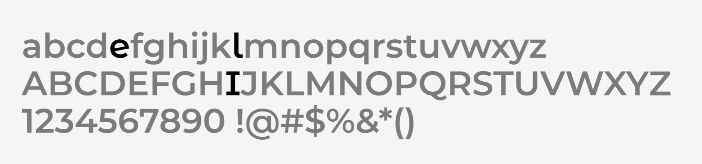

# Montsera11y

Een toegankelijkere versie van het [Montserrat](https://github.com/JulietaUla/Montserrat)-lettertype, gemaakt door [Eleven Ways](https://www.elevenways.be).

De naam **Montsera11y** combineert Montserrat, **a11y** (accessibility) en **11** (Eleven Ways).



## Wat is er aangepast?

Vier karakters worden aangepast om de leesbaarheid te verhogen:

| Karakter | Aanpassing | Doel |
|----------|-----------|------|
| `e` | Schuine crossbar | Beter onderscheid, meer open aperture |
| `l` | Serif linksboven | Onderscheid van `I` en `1` |
| `I` | Bilaterale schreven boven en onder | Onderscheid van `l` en `1` |
| `w` | Serif linksboven | Consistent met `l`-stijl |

## Gewichten

Het lettertype is beschikbaar in 4 gewichten, elk met een italic variant:

- Light (300)
- Regular (400)
- Medium (500)
- Bold (700)

## Bestanden

```
working/            ← Bronbestanden (bewerkt in FontForge)
output/ttf/         ← Hernoemde TTF-bestanden
output/woff2/       ← WOFF2-bestanden voor webgebruik
scripts/
  rename_font.py    ← Hernoemen Montserrat → Montsera11y + WOFF2-generatie
  verify_font.py    ← Metadata-verificatie
test.html           ← Visuele testpagina
```

## Gebruik

### Fonts genereren na bewerking in FontForge

```bash
python3 scripts/rename_font.py working/ output/
python3 scripts/verify_font.py output/ttf/
```

### Testpagina bekijken

```bash
python3 -m http.server 8888
open http://localhost:8888/test.html
```

## Licentie

Gelicentieerd onder de [SIL Open Font License, Version 1.1](OFL.txt).

Het originele Montserrat declareert geen Reserved Font Name.
